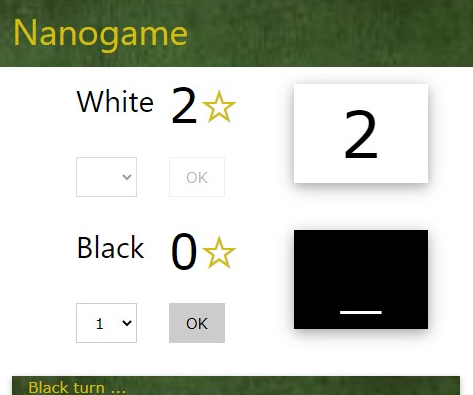

# Nanogame-js

Using JavaScript, **nanogame-js** implements a GUI and a rules engine for the **Nanogame** boardgame. The intent is then to learn how to implement a game on the [Board Game Arena](https://fr.boardgamearena.com/) (BGA) and also to test some architecture principle.

The rules of **Nanogame** are the following:

- Two players are involved: white and black.
- It is a turn-based game. White starts the play.
- Each player receives 5 cards randomly selected from a shared deck of cards numbered from 1 to 15. The received cards are visible for their owner, but are hidden to the opponent.
- On his turn, the active player selects one card which becomes visible to his opponent. The opponent does the same. The owner of the highest played card has his score incremented by 1 point and becomes the next active player.
- The game ends when all player cards have been played. The winner is the player with the highest score.

If you intent to derive or to sell either a text, a product or a software from this work, then read the [**LICENSE**](./docs/LICENSE.txt) and the  [**COPYRIGHT**](./docs/COPYRIGHT.md)  documents.
